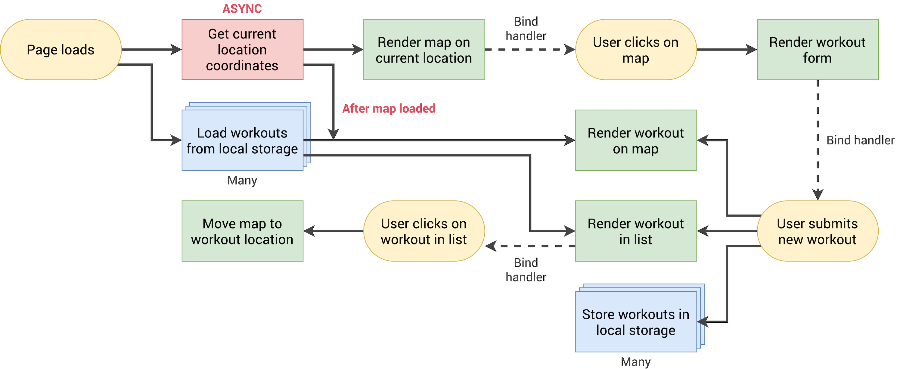
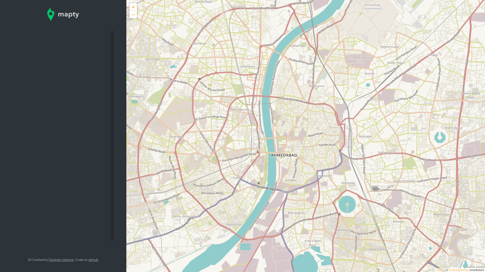
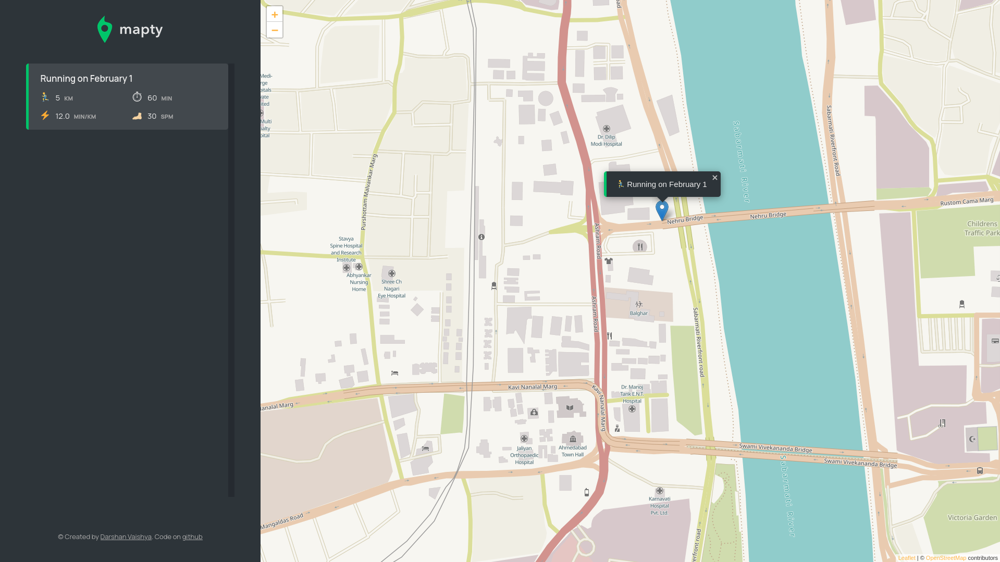
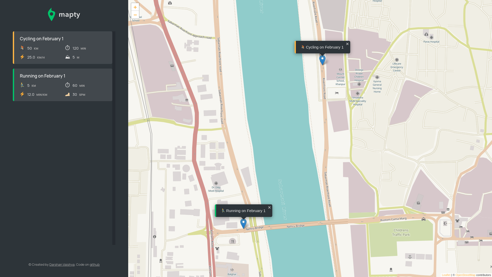

# Mapty App

## Table of contents

- [Overview](#overview)
  - [Technologies used](#technologies-used)
- [Flowchart](#flowchart)
- [Challenges faced](#challenges-faced)
- [Learning outcomes](#learning-outcomes)
- [Screenshots](#screenshots)
- [Directory structure](#directory-structure)
- [Collaboration](#collaboration)
- [Contact me](#contact-me)

## Overview

Mapty is a web app which helps users by allowing them to store their workouts on the web. The app automatically detects users location and opens the map. The users can click on a position and store their workout details such as distance, duration, time and so on.

Live preview: [Link](https://mapty.darshanvaishya.xyz/)

[](https://app.netlify.com/sites/heuristic-aryabhata-5c34b0/deploys)

### Technologies used

- HTML
- CSS
- JavaScript
- [Leaflet library](https://leafletjs.com/)
- Geolocation API
- Local storage API

## Flowchart



## Challenges faced

The main concept of the project was to show the users map of their area. The first hurdle was to get the user's current location. The geolocation API was exteremly useful here as it returned the user's precise location in co-ordinates.

```js
navigator.geolocation.getCurrentPosition((position) => console.log(position));
```

Now I had to figure out how to render the map based on this co-ordinates. I found out about the Leaflet library which made things very easy! The documentation were great help while making this project. It was as simple as writing this code to get the map up and running.

```js
// Position object is returned by geolocation API
_loadMap(position) {
    const { latitude, longitude } = position.coords;

    this.#map = L.map("map").setView([latitude, longitude], this.#mapZoomLevel);

    L.tileLayer("https://{s}.tile.openstreetmap.fr/hot/{z}/{x}/{y}.png", {
        attribution:
            '&copy; <a href="https://www.openstreetmap.org/copyright">OpenStreetMap</a> contributors',
    }).addTo(this.#map);

    this.#map.on("click", this._showForm.bind(this));
    this.#workouts.forEach((workout) => this._renderWorkoutMarker(workout));
}
```

It uses openstreetmap by default to provide the map but one can also use google maps.
One trivial challenge I faced was creating unique ID for each workout. I didn't want to use an library for this as there is no backend for this project. So the issue of conflicting ID was eliminated. In the end, I used the Date library to generate unique IDs.

```js
id = String(Date.now());
```

## Learning outcomes

This project helped me solidify my OOPs concept as everything is a class in this project. It was a great practice of inheritance, private members, public interface communication and so on. Also for the first time I used a third party library, and it was a blast to learn. Working with async JavaScript also brought some issues, but my understanding of it increased greatly after this project.

In CSS, I learnt a great way to animate removal of an element. All I have to do is to set `height: 0` and once the transition for it ends, call the `element.remove()` method.

## Screenshots

### Main screen



### Add running



### Add cycling



## Directory structure

```
.
├── index.html
├── README.md
└── assets
    ├── css
    │   └── style.css
    ├── img
    │   ├── icon.png
    │   ├── logo.png
    │   ├── Mapty-architecture-final.png
    │   ├── Mapty-architecture-part-1.png
    │   ├── Mapty-flowchart.png
    │   ├── og-image.png
    │   └── screenshots
    │       ├── cycling.png
    │       ├── main.png
    │       ├── og-tag.png
    │       └── running.png
    └── js
        └── script.js

5 directories, 14 files
```

## Collaboration

If you have found a bug, suggesting an improvement or want to collaborate then please raise an [issue](https://github.com/DarshanVaishya/mapty-app/issues) or create an [pull request](https://github.com/DarshanVaishya/mapty-app/pulls).

## Contact me

- [Twitter](https://twitter.com/darshan_vaishya)
- [LinkedIn](https://www.linkedin.com/in/darshan-vaishya-ba99001a9/)
